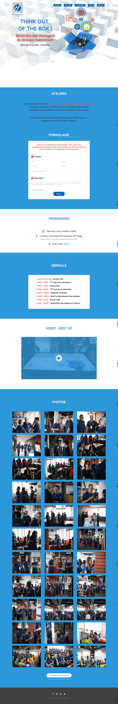

# HOLMARCOM GROUP Morocco - THINK OUT OF THE BOX !

HOLMARCOM GROUP Morocco - THINK OUT OF THE BOX ! (Séminaire des Managers du Groupe Holmarcom)

## Source code

> Private

## Demo

[Online-Demo]

## Dependencies

This project was bootstrapped with [Create React App](https://github.com/facebook/create-react-app).

- [react] - React is a JavaScript library for building user interfaces. version: 16.9.0
- [react-dom] - React package for working with the DOM. version: 16.9.0
- [axios] - Promise based HTTP client for the browser and node.js version: 0.19.0
- [lightbox-react] - Lightbox for React components or images version: 0.3.7
- [react-photo-gallery] - Responsive Justified React Image Gallery Component version: 8.0.0
- react-images - A mobile-friendly, highly customizable, carousel component for displaying media in ReactJS version: 1.0.0

## License

© [ABDELAZIZ EL ARASSI](https://www.linkedin.com/in/aelarassi/)

[react]: https://reactjs.org/
[react-dom]: https://reactjs.org/
[axios]: https://github.com/axios/axios
[lightbox-react]: http://treyhuffine.com/lightbox-react
[react-photo-gallery]: https://github.com/neptunian/react-photo-gallery
[online-demo]: http://appeditor.co/holmarcom
